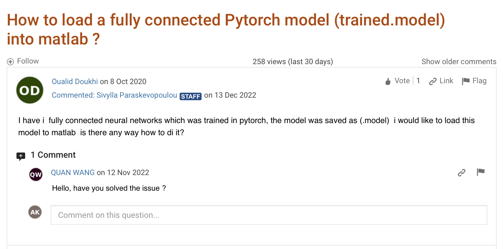

In this short post, we will attempt to run a UNet model implemented using PyTorch (and MONAI, really) within MATLAB. Watch the video we published on the [MathWorks YouTube channel here](https://www.youtube.com/watch?v=az51x0bIZ9Q)! All the associated code and data is available on GitHub: [@amithjkamath/monai-from-matlab](https://github.com/amithjkamath/monai-from-matlab).

This is inspired by questions on MATLAB Answers like this:

or 

Now one may ask what the use-case for this is, for which I have the following three points:

* You already have some pre-processing/post-processing code in MATLAB that you don't want to re-implement with python.
* You are primarily a MATLAB user, and have been handed off a fancy deep learning model from a colleague who doesn't care enough to help you use it somehow.
* You need to do some interactive labeling (something this post doesn't delve into) and don't want to re-invent the wheel and instead want to use the Labeler Apps in MATLAB.

If you fall into these three (or potentially another unknown) categories, read on.

----------

## Setting up the MATLAB + Python interface

This is a pre-requisite for the rest of the steps, and even though could be rather involved, it is a one-time setup, and hence not so difficult. Here's how I did this on my MacOS 13.3 running MATLAB R2022b:

### 1. Create a new MATLAB conda environment

Assuming you have Anaconda/miniconda setup (see https://docs.anaconda.com/free/anaconda/install/index.html if you haven't already), I recommend creating a separate environment to interact with MATLAB. This can be done in the terminal using:

    % conda create --name matlab-env python=3.9

Make sure the version of python matches one that is supported by your MATLAB version here: https://ch.mathworks.com/support/requirements/python-compatibility.html (in my case, 3.9 worked). 

Then, activate the environment and find out where the python executable is:

    % conda activate matlab-env 
    
Then, you run:

    % which python

to find the location of the python executable. In my case, for example, it is here (remember this for step 3): 
    
    /Users/amithkamath/opt/anaconda3/envs/matlab-env/bin/python

### 2. Install python dependencies

Next, install pytorch/monai (or whatever dependencies your python code while running in MATLAB has) using %conda install ... . To run examples from PyTorch for segmentation, we need both PyTorch and torchvision installed.

    % conda install pytorch torchvision

If required, also consider installing monai using

    %pip install monai

(If pip isn’t available, you need to set it up, using %conda install pip)

### 3. Get MATLAB to recognize this environment + libraries

Now start MATLAB and run pyversion with this path (from step 1 above). In my case, this turns out to be:

    >> pyversion('/Users/amithkamath/opt/anaconda3/envs/matlab-env/bin/python')

And check that `pe = pyenv` points to the right locations and all the fields make sense. This returns:

    pe = 
        PythonEnvironment with properties:

        Version: "3.9"
        Executable: "/Users/amithkamath/opt/anaconda3/envs/matlab-env/bin/python"
        Library: "/Users/amithkamath/opt/anaconda3/envs/matlab-env/lib/libpython3.9.dylib"
        Home: "/Users/amithkamath/opt/anaconda3/envs/matlab-env"
        Status: Loaded
        ExecutionMode: OutOfProcess
        ProcessID: "67023"
        ProcessName: "MATLABPyHost"

Finally, we need to load the python module with functions that are called from MATLAB. To do this, you need to add the module to the ‘path’, this is done using `py.importlib.import_module(‘’)`. For example, with the code in this demonstration, it should look something like this:

    >> py.importlib.import_module('monaiInference')
        ans =

        Python module with properties:
            createModel: [1×1 py.function]
            <module ... >

If all of this is setup, congratulations! You can now simply open the live-script titled `testMONAIConnector.mlx`, and follow along with the sections.

----------

## Running the UNet model inference:

In the first section, we reset the python environment within MATLAB, and load the module with the code we expect to run from. Note that while running MATLAB, you don't need to activate the virtual environment separately, or even open the terminal at all. Once the previous setup has been tested (in step 3), everything else thereon is in MATLAB!

    terminate(pyenv)
    pyversion('/Users/amithkamath/opt/anaconda3/envs/matlab-env/bin/python')
    py.importlib.import_module('monaiInference');

----------

Next, we call directly the `create_model` function/method defined in the python module called `monaiInference` from MATLAB. The input to this function is the path to the `.pth` file where the weights have been saved. This creates a UNet object in the MATLAB workspace! 

    monaiUNet = py.monaiInference.create_model("heart-2d-model.pth")

Note that you need to edit the `create_model` function to construct another architecture of your choice if the `.pth` file contains weights corresponding to that architecture. In this example, we use a UNet built using MONAI, and hence the code is really simple:

    def create_model(model_path):
        config = {
            "unet_model_params": dict(
                spatial_dims=2,
                in_channels=1,
                out_channels=1,
                channels=(16, 32, 64, 128, 256, 512),
                strides=(2, 2, 2, 2, 2),
                num_res_units=0,
                norm=Norm.BATCH,
                act="ReLU",
                bias=False,
            ),
        }
        model = UNet(**config["unet_model_params"])
        model.load_state_dict(torch.load(model_path))
        return model

Bear in mind to import all the necessary dependencies! 

----------

Then, we need to load images to run inference on, and this should be reasonably straightforward MATLAB code `imread` and so on. Note that we divide the image by 255 to scale the intensity. The model trained in MONAI used the `ScaleIntensity` transformation, and this operation simply mimics this pre-processing step. Also, if you're confused with the `reshape` operation, this is needed because the model expects a 4-D array, where the first two are batch size and channel size - both of which are 1 for a single grayscale image. 

----------

Finally, we run the inference. There's some magic in this section that needs some explanation. The line to run inference is:

    seg = py.monaiInference.inference(monaiUNet, py.torch.tensor(py.numpy.array(im_channel)));

Note that we need to cast the MATLAB array in `im_channel` first to a numpy array, and then to a torch tensor. The calls wrapping `py.numpy.array` and `py.torch.tensor` do just this, where `py` really indicates to MATLAB that whatever comes after it is from a module that's available in the `pyenv` loaded. A similar story in this line:

    seg = squeeze(single(py.numpy.array(seg)));

to undo these data type changes and bring things back to the MATLAB world. Of course these could be done more neatly within a function, but then it's harder to show exactly what happens under the hood (and so pardon my shabby code in the interest of interpretability ;-) )

----------

And voila, there you have it: a fully functioning UNet model running within MATLAB! If you asked me a few years ago if something like this could be possible, I'd have laughed out loud. I'm glad to see how languages and tools evolve over time, and hope to see more movements in these directions! 

----------

## References

https://github.com/matlab-deep-learning/Automate-Labeling-in-Image-Labeler-using-a-Pretrained-TensorFlow-Object-Detector for taking this a step further and running a model within an automation algorithm (possibly fodder for another blog post here, next!)

https://ch.mathworks.com/products/matlab/matlab-and-python.html?requestedDomain=en for general notes on Python + MATLAB.